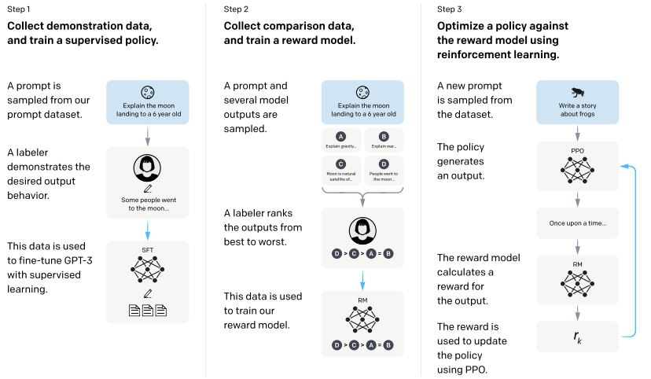
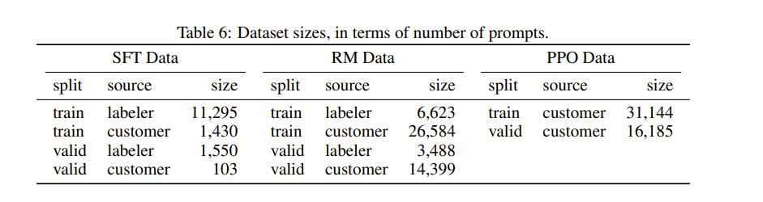
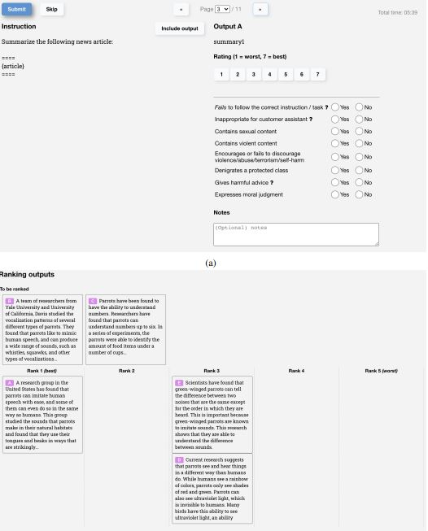

# Training language models to follow instructions with human feedback

# Overview (Kit)

# Architecture Overview (Tony)

## Methodology Overview

  

* **Goal**: Build a model environment to align models to be more helpful, honest, and harmless.
* Step 1 (Supervised Fine-Tuning): Using demonstration data, which includes prompts and expected outputs, to fine-tune a GPT model to learn directly from example
* Step 2 (Reward Modeling): Using comparison data, which includes prompts and generated outputs with rankings, to select outputs that are more aligned to human preference
* Step 3 (Reinforcement Learning from Human Feedback): Language model (InstructGPT) is further fine-tuned using reinfocement learning, guided by reward model to generate ouputs that maximize the predicted human preference 

## Data Collection

  

## Step 1: Supervised Fine-Tuning (SFT)

## Step 2: Reward Modeling (RM)

  

## Step 3: Reinforcement Learning

# Critical Analysis (Kit)

# Resources
**Original Devlopement of Reinforcement Learning from Human Feedback**
Christiano, P. F., Leike, J., Brown, T., Martic, M., Legg, S., and Amodei, D. (2017). Deep reinforcement learning from human preferences. In Advances in Neural Information Processing Systems, pages 4299–4307

**Previous Work on Training Language Models to Follow Instructions**
Yi, S., Goel, R., Khatri, C., Cervone, A., Chung, T., Hedayatnia, B., Venkatesh, A., Gabriel, R., and Hakkani-Tur, D. (2019). Towards coherent and engaging spoken dialog response generation using automatic conversation evaluators. arXiv preprint arXiv:1904.13015

**Overview of Risks with Langauge Models**
Bender, E. M., Gebru, T., McMillan-Major, A., and Shmitchell, S. (2021). On the dangers of stochastic parrots: Can language models be too big? In Proceedings of the 2021 ACM Conference on Fairness, Accountability, and Transparency, pages 610–623.

**Fine-tuning Langauge Models to Improve Model's Ability to Adhere to Better Values on a Question Answering Task**
Solaiman, I. and Dennison, C. (2021). Process for adapting language models to society (palms) with values-targeted datasets. arXiv preprint arXiv:2106.10328.

**A Promising Future Path for RLHF Using Control Codes**
Keskar, N. S., McCann, B., Varshney, L. R., Xiong, C., and Socher, R. (2019). Ctrl: A conditionaltransformer language model for controllable generation. arXiv preprint arXiv:1909.05858.

**Proposal to Align Superhuman Systems using RLHF**
Leike, J., Krueger, D., Everitt, T., Martic, M., Maini, V., and Legg, S. (2018). Scalable agent alignment via reward modeling: a research direction. arXiv preprint arXiv:1811.07871.

**Theoretical Research on Alignment**
Soares, N., Fallenstein, B., Armstrong, S., and Yudkowsky, E. (2015). Corrigibility. In Workshops at the Twenty-Ninth AAAI Conference on Artificial Intelligence.

**A Promising Future Path for RLHF Modifying the Sampling Procedure**
Dathathri, S., Madotto, A., Lan, J., Hung, J., Frank, E., Molino, P., Yosinski, J., and Liu, R. (2019). Plug and play language models: A simple approach to controlled text generation. arXiv preprintarXiv:1912.02164.

# Paper Citation
Ouyang, L., Wu, J., Jiang, X., Almeida, D., Wainwright, C. L., Mishkin, P., Zhang, C., Agarwal, S., Slama, K., Ray, A., Schulman, J., Hilton, J., Kelton, F., Miller, L., Simens, M., Askell, A., Welinder, P., Christiano, P., Leike, J., & Lowe, R. (2022). Training language models to follow instructions with human feedback. [Preprint]. arXiv. https://arxiv.org/abs/2203.02155
