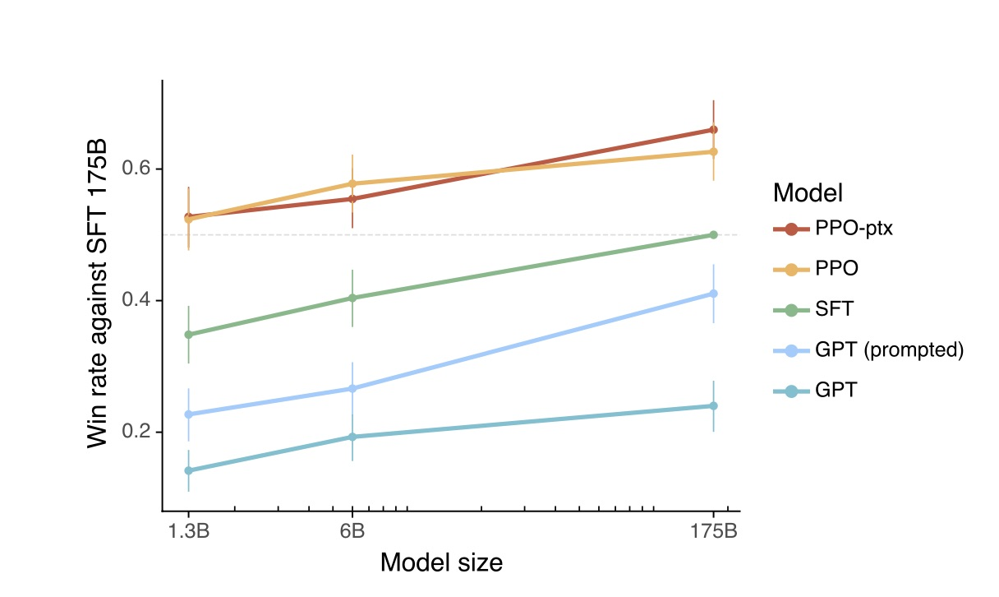
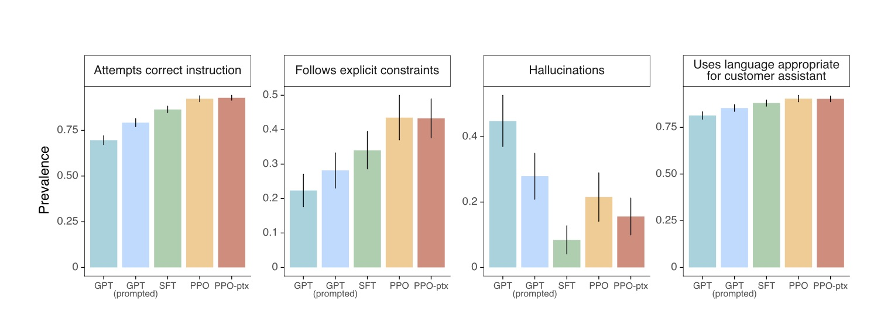

# Training language models to follow instructions with human feedback

# Overview

## Problem Statement

* Large Language models (LLMs) often generate outputs that do not align with user intentions, including untruthful, biased, or irrelevant responses.
* This is called misalignment, which becomes problematic as LLMs are increasingly used across a wide range of applications.
* Despite the increasing size of LLMs, their proficiency in accurately understanding and executing user intents does not necessarily progress, leading to outputs that may be misaligned, biased, or inadvertently toxic.
* The core issue addressed is ensuring LLMs act in ways that are beneficial, truthful, and ethically aligned with user expectations.
* The paper proposes leveraging human feedback for fine-tuning LLMs to better align them with human intent across various tasks.

## Misalignment

Misalignment refers to the discrepancy between the outputs generated by LLMs and the intentions or expectations of their human users. This includes the following...
* Untruthful Outputs
  - LLMs are not guaranteed to produce correct answers. As the output is a result of a probability distribution, a LLM may prioritize textual patterns learned from training, leading to an incorrect response, misinforming the user.
* Biased or Toxic Content
  - Outputs perpetuating stereotypes, biases, or harmful idealogies/speech can not only harm the users, but influence opinions and reinforce possible prejudices.
* Non-adherence to Instructions
  - Failure to follow user-defined instructions is a key drawback of LLMs. Certain users may desire a precise output, which if not followed by the LLM leads to unhelpful results.
* Lack of Harmlessness
  - Providing improper advice (medical, job-related, etc.) or possibly encouraging risky behaviors are harmful to the users.

## Solution: InstructGPT

* InstructGPT is a proposed solution involving two stages of fine-tuning a pretrained GPT-3 model using human feedback.
  - Stage 1: Utilizes labeler-written and API user prompts to collect a dataset showcasing desired model behaviors for supervised fine-tuning (SFT).
  - Stage 2: Gathers a dataset of model output rankings (reward model (RM)), reflecting human preferences, to further fine-tune the model through reinforcement learning from human feedback (RLHF).
 
## Question 1

Considering the ethical implications, how might the biases of the human labelers and the sources of the prompts (API users) affect the outcomes of InstructGPT's training? Could this influence its ability to be universally beneficial?

<details>
<summary><b>Hint</b></summary>

Reflect on the diversity of the human labelers and the users of the API, considering how their perspectives and biases could be encoded into the model during the fine-tuning process.

</details>

<details>
<summary><b>Answer</b></summary>

The biases of human labelers and the perspectives of API users could lead to a model that reflects specific worldviews or biases, potentially affecting its universality and fairness. Diverse and representative training data, along with careful consideration of the labelers' selection process, are crucial to mitigate these issues.

</details>

## Results

<p align="center">
  
</p>

<p align="center">
  
</p>

* Preference for InstructGPT: Human evaluators consistently preferred outputs from InstructGPT over those from the original GPT-3 model across a wide range of prompts, demonstrating its better alignment with human intent.
* Improvements in Truthfulness and Reduction in Toxicity: InstructGPT shows marked improvements in producing truthful content and reducing toxicity without significant regressions in performance on standard NLP tasks.
* Generalization to Unseen Tasks: The model demonstrates promising abilities to generalize the notion of "following instructions" to tasks and instructions not explicitly covered in the training data.

## Question 2

Given the improvements in truthfulness and reductions in toxicity achieved by InstructGPT, what are the potential limitations of using human feedback as the sole criterion for evaluating these aspects?

<details>
<summary><b>Hint</b></summary>

Consider the challenges in objectively measuring concepts like "truthfulness" and "toxicity," especially in complex or nuanced contexts where human judgment may vary.

</details>

<details>
<summary><b>Answer</b></summary>

Human feedback, while invaluable, may not always capture the full complexity of what constitutes "truthful" or "non-toxic" content. Subjectivity in human judgments, the potential for inconsistent evaluations, and the scalability of collecting human feedback are significant limitations. Automated, yet nuanced, evaluation metrics may be necessary to complement human judgment.

</details>

# Architecture Overview

## Methodology Overview

<p align="center">
  
</p>

* **Goal**: Build a model environment to align models to be more helpful, honest, and harmless.
* Step 1 (Supervised Fine-Tuning [SFT]): Using demonstration data, which includes prompts and expected outputs, to fine-tune a GPT model to learn directly from example.
* Step 2 (Reward Modeling [RM]): Using comparison data, which includes prompts and generated outputs with rankings, to select outputs that are more aligned to human preference.
* Step 3 (Reinforcement Learning from Human Feedback [RL or PPO]): Language model (InstructGPT) is further fine-tuned using reinfocement learning, guided by reward model to generate ouputs that maximize the predicted human preference. 


## Data Collection

* Prompts primarily consist of OpenAI prompts from actual users that agreed to use a GPT model on a playground interface.
* In addition, labelers wrote prompts themselves for an initial source of instruction-like prompts to bootstrap the process. This include:
    * Plain: Labelers were asked to come up with an arbitrary task,
    * Few-Shot: labelers came up with an instruction and multiple responses to choose from, and
    * User-based: lablers came up with prompts that were use-cases to users on a waitlist to increase diversity in our data.
* Prompts include the following categories:
    * Brainstorming
    * Classification
    * Extract
    * Generation
    * Rewrite
    * Chat
    * Closed QA
    * Open QA
    * Summarization.

<p align="center">
  
</p>

* 13k training prompts on Supervised Fine-Tuning.
* 33k training prompts on Reward Modeling.
* 31k training prompts on Reinforcement Learning.


## Step 1: Supervised Fine-Tuning (SFT)

* Train on Demonstration Data: Prompts with corresponding labeled outputs from labelers (to handle quality control).
* Model Purpose: Training the language model to replicate and generate responses, improving its ability to generate text that meet the alignment standards
* Model Objective: Minimize the difference between modeling generated outputs and human-provided target outputs

---

**Algorithm 1:**
$\Theta_{ft} \leftarrow \text{SFT}(X, Y, \Theta)$

#### Inputs
- `X, Y`: Labeled demonstration data, where `X` represents the input prompts and `Y` represents the corresponding target outputs.
- `Θ`: Initial parameters of the GPT-3 model.

#### Output
- `Θ_ft`: The model parameters adjusted through the fine-tuning process.

#### Hyperparameters
- `N_epochs ∈ ℕ`: Number of epochs, representing the total number of passes over the entire training dataset.
- `batch size`: The number of training examples utilized in one iteration.
- `η_init`: Initial learning rate, a scalar used to adjust the magnitude of parameter updates at the start of training.
- `β1, β2, ε`: Hyperparameters specific to the Adam optimizer. `β1` and `β2` control the exponential decay rates for the moment estimates. `ε` is a small scalar added to prevent division by zero in the optimizer's calculations.

#### Process
1. **Initialization**: Prepare the GPT-3 model with the pretrained weights `Θ` and initialize the Adam optimizer with the specified initial learning rate `η_init` and hyperparameters.

2. **Training Loop**:
   - For each epoch `i` from 1 to `N_epochs`:
     - **Cosine Decay Adjustment**: Adjust the learning rate `η` for the current epoch using the cosine decay formula. The adjusted learning rate `η` is calculated as follows:
       ```
       η = η_init * (1 + cos(pi * i / N_epochs)) / 2
       ```
       This formula gradually decreases the learning rate from `η_init` to near 0 following a cosine curve over the epochs.
     - For each batch `(input_batch, target_batch)` in the dataset:
       - **Forward Pass**: Compute the predicted output `Y_hat` for `input_batch` using the GPT-3 model.
       - **Loss Calculation**: Compute the loss using a suitable `LossFunction` that measures the difference between `Y_hat` and `target_batch`.
       - **Backward Pass and Parameter Update**: Use the Adam optimizer with the current learning rate `η` to update the model parameters `Θ_ft` based on the gradients of the loss function.

3. **Output**: Return the fine-tuned model parameters `Θ_ft`.

---


## Step 2: Reward Modeling (RM)

* Train on Comparison Data: Rather than training a model on generating text, we want the model to select the best output that the SFT model generated. Thus, the data used to train the reward model includes a prompt along with rankings of desired outputs

<p align="center">
  
</p>

* Model Purpose: Evaluate the quality of generated texts providing a reward signal that indicates how well a piece of text meets the alighment criteria. This acts as a proxy for human judgement
* Model Objective: accuratley predict human preferences among different generated outputs from the same input, using the following loss function:

$$\text{loss}(\Theta) = -\frac{1}{\binom{K}{2}}E_{(x,y_w,y_l)\sim D}[log(\sigma(r_\Theta(x,y_w)-r_\Theta(x,y_l)))]$$ 

---

**Algorithm 2**
$\Theta_{RM} \leftarrow \text{RM}(X, Y_K, \Theta)$

#### Inputs
- `D`: Dataset of sets, each containing `K` responses \((x, \{y_1, y_2, ..., y_K\})\), where `x` is an input prompt and `\{y_1, y_2, ..., y_K\}` are the responses with implied pairwise preferences among them based on human judgments.
- `Θ_initial`: Initial parameters for the reward model

#### Output
- `Θ_RM`: Adjusted reward model parameters after the training process.

#### Hyperparameters
- `N_epochs ∈ ℕ`: Number of training epochs, indicating the total number of complete passes over the dataset `D`.
- `batch size`: The number of sets processed in one iteration of training.
- `η`: Learning rate, a scalar used to adjust the magnitude of parameter updates.
- `Optimizer`: Adam, including its specific hyperparameters `β1`, `β2`, and `ε`.

#### Process
1. **Initialization**: 
   - Initialize the reward model with parameters `Θ_initial`.
   - Prepare the optimizer with the learning rate `η` and its hyperparameters.

2. **Training Loop**:
   - For `epoch` in range(1, `N_epochs`+1):
     - Shuffle dataset `D` to ensure a random distribution of data in each epoch.
     - For each set \((x, \{y_1, y_2, ..., y_K\})\) in `D`:
       - Initialize `set_loss` to 0.
       - Generate all possible pairs `(y_w, y_l)` from the set of `K` responses, considering `y_w` is preferred over `y_l`.
       - For each pair `(y_w, y_l)` in the set:
         - Compute `score_diff = r_Θ(x, y_w) - r_Θ(x, y_l)`.
         - Calculate the logistic loss for the pair: `pair_loss = -log(sigma(score_diff))`.
         - Accumulate the loss: `set_loss += pair_loss`.
       - Normalize set loss by the total number of pairs $\binom{K}{2}$ in the set to compute the average loss: $averageLoss = \frac{setLoss}{\binom{K}{2}}$.
       - Update `Θ_RM` using the optimizer to minimize `average_loss`.

3. **Output**: 
   - Return the trained reward model parameters `Θ_RM`.

---

## Step 3: Reinforcement Learning

* Proximal Policy Optimization (PPO): Type of reinfocement learning algorithm use to improve models using a reward signal to uptate the model (i.e. it's policy) to increase rewards over time. In this case, we use the RM to update the parameters of the SFT model in accordance.
* Train on Prompt data: This includes unlabled data from the customers (to prepare the models for real-world use-cases)
* Model Purpose: Fine-tune the language model to generate text that maximizes the rewards by the reward model. It's goal is to align the generated text to what humans consider good using the RM as a proxy.
* Model Objective: The model's objective is to align the langauge model to a more helpful chatbot in this learning environment using the following objective function:
$$objective(\Theta) = E_{(x,y)\sim D_{\pi_\Theta^{RL}}}[r_\Theta(x,y)-\beta log(\pi_\Theta^{RL}(y|x)/\pi^{SFT}(y|x))] + \gamma E_{x\sim D_{\text{pretrain}}}[log(\pi_\Theta^{RL}(x))]$$

---
**Algorithm 3**
$\Theta_{RL} \leftarrow \text{RL}(X, RM, \Theta_{SFT})$

#### Inputs
- `X`: Prompts for reinforcement learning, generated under policy $\pi_{\Theta}^{RL}$.
- `Θ_RL_initial`: Initial parameters of the RL-tuned language model.
- `Θ_SFT`: Parameters of the Supervised Fine-Tuning (SFT) model for reference.
- `RM`: Trained Reward Model.

#### Output
- `Θ_RL`: Updated parameters of the RL-tuned language model after optimization.

#### Hyperparameters
- `N_epochs ∈ ℕ`: Number of epochs, indicating the total number of complete passes over the reinforcement learning dataset `D_RL`.
- `batch size`: The number of input prompts processed in one iteration of training.
- `η`: Learning rate, a scalar used to adjust the magnitude of parameter updates.
- `β`: Coefficient for controlling deviation from SFT policy.
- `γ`: Coefficient for maintaining general language capabilities.
- `Optimizer`: Adam, including its specific hyperparameters `β1`, `β2`, and `ε`.

#### Process
1. **Initialization**: 
   - Initialize the RL-tuned language model with parameters `Θ_RL_initial` with `Θ_SFT`
   - Prepare the optimizer (Adam) with the learning rate `η` and its hyperparameters (`β1`, `β2`, `ε`).

2. **Training Loop**:
   - For `epoch` in range(1, `N_epochs`+1):
     - Shuffle prompts `X` to ensure a random distribution of data in each epoch.
     - For each batch of input prompts `(x)` from `X`:
       - Generate responses `(y)` using the current policy $\pi_{\Theta}^{RL}$.
       - For each response `(y)` given input `(x)`:
         - Compute the reward `r_{\Theta}(x, y)` using RM.
         - Calculate the log probability ratio $log(\pi_{\Theta}^{RL}(y|x) / \pi^{SFT}(y|x))$.
         - Compute the objective function:
           - $objective(\Theta) = E_{(x,y)\sim D_{\pi_\Theta^{RL}}}[r_{\Theta}(x,y)] - \beta log(\pi_{\Theta}^{RL}(y|x)/\pi^{SFT}(y|x)) + \gamma E_{x\sim D_{\text{pretrain}}}[log(\pi_{\Theta}^{RL}(x))]$.
         - Update `Θ_RL` using the optimizer to maximize the objective function, effectively minimizing the loss.
     
3. **Output**: 
   - Return the updated parameters `Θ_RL` for the RL-tuned language model.


---


# Critical Analysis

While the paper covered the succes of aligning the model with human intentions from feedback, there were a few things yet to be discussed...

* Scalability - Models continue to grow in size, applications, and complexity. As these all occur, this approach may not be as feasible as it relies on manual intervention to cover all possibilities.
* Diversity in Feedback - The paper does not discuss how diversity in the human labelers may impact the alignment across cultures. An extremely wide amount of diversity would be necessary to avoid omitting any cultures or embedding potential biases in the model.
* Other Alignment Techniques - While the paper compared the model directly to well known GPT models, it did not address or compare the model to additional alignment based models, which would provide a more in depth comparison of the results.

# Resources
**Original Devlopement of Reinforcement Learning from Human Feedback**
Christiano, P. F., Leike, J., Brown, T., Martic, M., Legg, S., and Amodei, D. (2017). Deep reinforcement learning from human preferences. In Advances in Neural Information Processing Systems, pages 4299–4307

**Previous Work on Training Language Models to Follow Instructions**
Yi, S., Goel, R., Khatri, C., Cervone, A., Chung, T., Hedayatnia, B., Venkatesh, A., Gabriel, R., and Hakkani-Tur, D. (2019). Towards coherent and engaging spoken dialog response generation using automatic conversation evaluators. https://arxiv.org/abs/1904.13015.

**Overview of Risks with Langauge Models**
Bender, E. M., Gebru, T., McMillan-Major, A., and Shmitchell, S. (2021). On the dangers of stochastic parrots: Can language models be too big? In Proceedings of the 2021 ACM Conference on Fairness, Accountability, and Transparency, pages 610–623.

**Fine-tuning Langauge Models to Improve Model's Ability to Adhere to Better Values on a Question Answering Task**
Solaiman, I. and Dennison, C. (2021). Process for adapting language models to society (palms) with values-targeted datasets. https://arxiv.org/abs/2106.10328.

**A Promising Future Path for RLHF Using Control Codes**
Keskar, N. S., McCann, B., Varshney, L. R., Xiong, C., and Socher, R. (2019). Ctrl: A conditional transformer language model for controllable generation. https://arxiv.org/abs/1909.05858.

**Proposal to Align Superhuman Systems using RLHF**
Leike, J., Krueger, D., Everitt, T., Martic, M., Maini, V., and Legg, S. (2018). Scalable agent alignment via reward modeling: a research direction. https://arxiv.org/abs/1811.07871.

**Theoretical Research on Alignment**
Soares, N., Fallenstein, B., Armstrong, S., and Yudkowsky, E. (2015). Corrigibility. In Workshops at the Twenty-Ninth AAAI Conference on Artificial Intelligence.

**A Promising Future Path for RLHF Modifying the Sampling Procedure**
Dathathri, S., Madotto, A., Lan, J., Hung, J., Frank, E., Molino, P., Yosinski, J., and Liu, R. (2019). Plug and play language models: A simple approach to controlled text generation. https://arxiv.org/abs/1912.02164.

# Paper Citation
Ouyang, L., Wu, J., Jiang, X., Almeida, D., Wainwright, C. L., Mishkin, P., Zhang, C., Agarwal, S., Slama, K., Ray, A., Schulman, J., Hilton, J., Kelton, F., Miller, L., Simens, M., Askell, A., Welinder, P., Christiano, P., Leike, J., & Lowe, R. (2022). Training language models to follow instructions with human feedback. [Preprint]. arXiv. https://arxiv.org/abs/2203.02155
